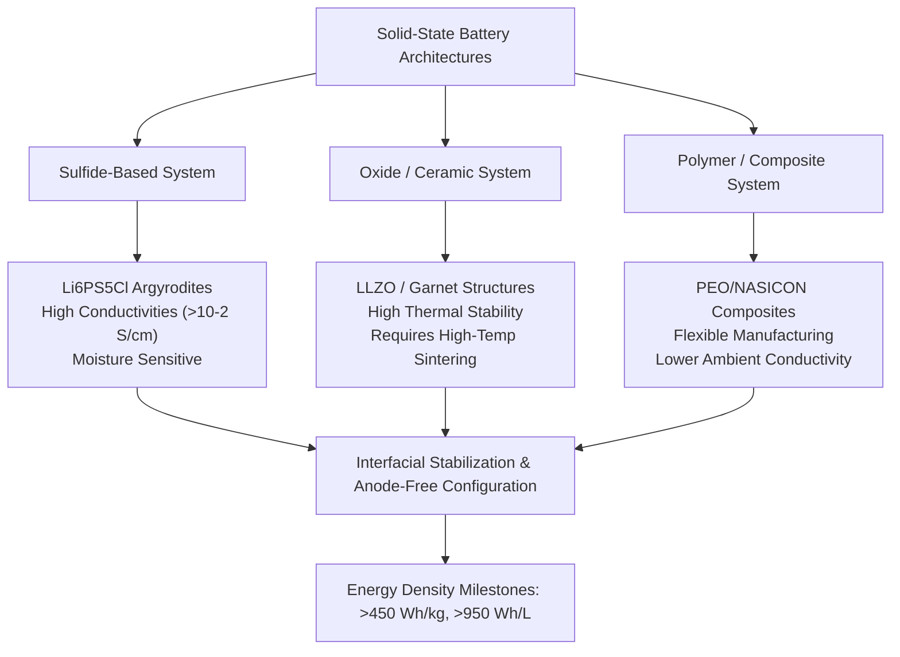
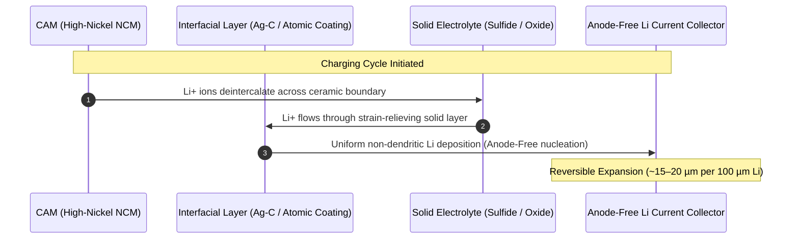
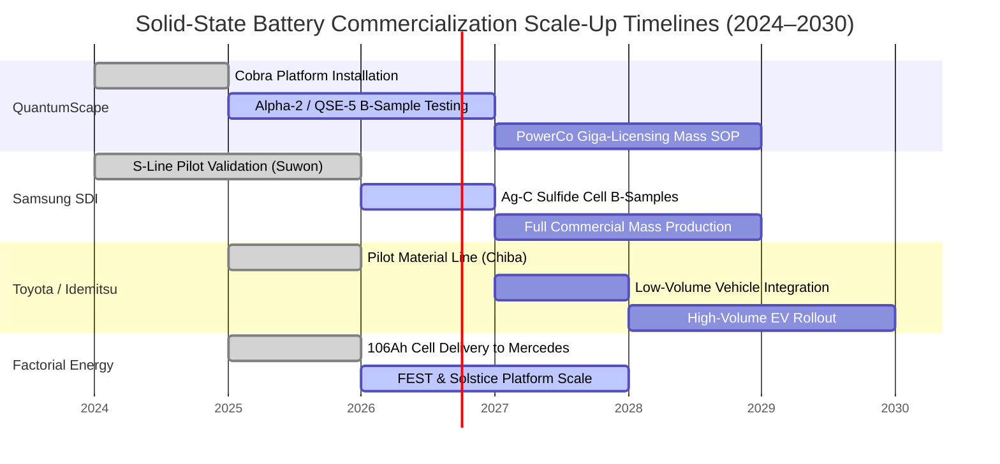
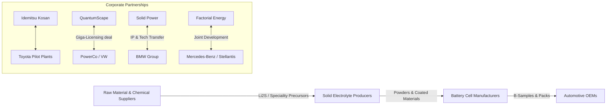

# The State of Solid-State Battery Technology: Technical Breakthroughs, Scale-Up Timelines, and Industrial Integration (August 2026)

## 1. Executive Summary

As of August 2026, solid-state battery (SSB) technology has transitioned from speculative laboratory electrochemistry into pre-commercial pilot manufacturing and automotive B-sample validation. Driven by the demand for higher gravimetric ($>400\text{ Wh/kg}$) and volumetric ($>900\text{ Wh/L}$) energy densities, superior fast-charging capabilities, and intrinsic safety, major energy storage developers and global automotive Original Equipment Manufacturers (OEMs) have committed tens of billions of dollars toward scaling solid-state cell production.

The industry landscape is defined by three primary electrolyte technology pathways: sulfide-based synthetics, ceramic/oxide separators, and polymer-inorganic composites. Breakthroughs in interfacial engineering, low-pressure stack mechanics, continuous roll-to-roll (R2R) ceramic sintering, and dry-electrode processing have significantly lowered the operational pressure requirements—bringing lithium-metal anode architectures closer to automotive operational envelopes. 

Commercialization has advanced from small-format single-layer cells to multi-layer, high-capacity pouch and prismatic formats ($60\text{ Ah}$ to $100+\text{ Ah}$). Industrialization efforts are centered on pilot plants such as QuantumScape’s expanded *Cobra* continuous heat-treatment line, Samsung SDI’s *S-line* in Suwon, and Toyota’s collaborative material processing facilities with Idemitsu Kosan. While niche applications in aerospace, premium consumer electronics, and high-performance automotive platforms are receiving initial low-volume pilot allocations in 2026, mainstream mass-market automotive Start of Production (SOP) remains targeted between 2027 and 2030 due to precursor supply chain bottlenecks, strict dry-room requirements, and yields in large-scale cell assembly.

---

## 2. Technical Breakthroughs and Electrochemistry Advances

### Solid Electrolyte Families & Ionic Conductivity Benchmarks

The competition among solid-state chemistries is bounded by trade-offs between ionic conductivity, mechanical compliance, electrochemical stability windows, and processability:

1. **Sulfide-Based Electrolytes (Argyrodites & Thio-LISICONs):**
   * *Chemical Formulations:* Chlorine-doped lithium argyrodites ($\text{Li}_{6}\text{PS}_{5}\text{Cl}_{1-x}\text{Br}_x$) and ternary systems ($\text{Li}_{10}\text{GeP}_{2}\text{S}_{12}$).
   * *Performance Metrics:* Room-temperature ionic conductivity ($\sigma_{i}$) has reached $1.2 \times 10^{-2}\text{ S/cm}$ to $2.5 \times 10^{-2}\text{ S/cm}$, exceeding conventional liquid organic electrolytes ($1.0 \times 10^{-2}\text{ S/cm}$).
   * *Mechanisms & Challenges:* Sulfide materials exhibit favorable mechanical ductility, allowing cold-pressing densification without high-temperature sintering. However, they react readily with ambient moisture to produce toxic hydrogen sulfide ($\text{H}_2\text{S}$) gas, requiring ultra-dry processing environments with dew points below $-55^\circ\text{C}$ to $-60^\circ\text{C}$.

2. **Oxide and Ceramic-Based Electrolytes (LLZO & NASICONs):**
   * *Chemical Formulations:* Garnet-type lithium lanthanum zirconium oxide ($\text{Li}_7\text{La}_3\text{Zr}_2\text{O}_{12}$, doped with Ta, Al, or Nb) and NASICON-type ($\text{Li}_{1+x}\text{Al}_x\text{Ti}_{2-x}(\text{PO}_4)_3$).
   * *Performance Metrics:* Ionic conductivities range between $5.0 \times 10^{-4}\text{ S/cm}$ and $1.5 \times 10^{-3}\text{ S/cm}$ at room temperature.
   * *Mechanisms & Challenges:* Oxide separators demonstrate high electrochemical stability against pure metallic lithium up to $5.0\text{ V}$ vs. $\text{Li}/\text{Li}^+$. The key engineering hurdle is their high Young's modulus ($>100\text{ GPa}$), which makes them brittle and prone to high interfacial contact resistance when coupled with solid cathodes and volume-changing anodes.

3. **Polymer and Hybrid/Composite Electrolytes:**
   * *Chemical Formulations:* Polyethylene oxide (PEO) matrices infused with lithium bis(trifluoromethanesulfonyl)imide (LiTFSI) and functional inorganic ceramic fillers (e.g., nanoscale LLZO or $\text{TiO}_2$).
   * *Performance Metrics:* Room-temperature ionic conductivity remains lower ($10^{-5}\text{ S/cm}$ to $10^{-4}\text{ S/cm}$), requiring elevated operating temperatures ($50^\circ\text{C}$ to $70^\circ\text{C}$) for optimal performance. Cross-linked interpenetrating polymer networks (IPNs) developed in late 2025 have pushed ambient performance close to $1.0 \times 10^{-3}\text{ S/cm}$.

### Interfacial Engineering & Dendrite Suppression Mechanics

Lithium dendrite propagation across solid electrolytes remains a major failure mode. Contrary to early theoretical models suggesting high-modulus ceramic separators would mechanically block dendrites, local stress concentrations along grain boundaries allow lithium deposition inside microscopic cracks at high current densities.

Key technical solutions implemented in 2025–2026 include:

* **Ag-C Nanocomposite Interlayers:** Pioneered in commercial-grade designs (such as Samsung SDI's prototype cells), a thin ($\sim 5\text{ }\mu\text{m}$) silver-carbon nanocomposite layer deposited directly on the negative current collector regulates lithium nucleation, suppresses localized current hot-spots, and allows reversible, dendrite-free lithium plating under stack pressures $< 1\text{ MPa}$.
* **Atomic Layer Deposition (ALD) Surface Modifications:** Sub-nanometer coatings of alumina ($\text{Al}_2\text{O}_3$) or lithium fluoride ($\text{LiF}$) on cathode active materials (CAM) prevent space-charge layer formation and sulfide oxidation at elevated voltages ($> 4.3\text{ V}$).
* **Halogenated Solid Electrolyte Interfaces (SEI):** In-situ formation of fluorinated and chlorinated interfacial layers via targeted electrolyte additives lowers interfacial resistance to $< 10\text{ }\Omega\cdot\text{cm}^2$.

### Cell Architectures and Energy Density Milestones

By removing porous separators, volatile organic solvents, and heavy graphite/silicon host matrices, solid-state designs enable "anode-free" or "anode-less" cell configurations. In these cells, metallic lithium plates directly onto the copper current collector during the initial charge cycle.

| Metric | Conventional Li-Ion (Liquid) | State-of-the-Art SSB (Aug 2026) | Target Next-Gen SSB (2028–2030) |
| :--- | :--- | :--- | :--- |
| **Gravimetric Energy Density** | $260 - 300\text{ Wh/kg}$ | $380 - 450\text{ Wh/kg}$ | $500 - 550\text{ Wh/kg}$ |
| **Volumetric Energy Density** | $700 - 750\text{ Wh/L}$ | $850 - 1000\text{ Wh/L}$ | $1100 - 1200\text{ Wh/L}$ |
| **Operating Stack Pressure** | Ambient ($< 0.1\text{ MPa}$) | $0.5 - 5.0\text{ MPa}$ | Ambient ($< 0.1\text{ MPa}$) |
| **Fast-Charge Rate (10–80% SOC)** | $20 - 30\text{ min}$ | $10 - 15\text{ min}$ | $< 10\text{ min}$ |
| **Cycle Life (80% Capacity Retention)**| $1,500 - 2,000\text{ cycles}$ | $800 - 1,200\text{ cycles}$ | $1,500+\text{ cycles}$ |
| **Operating Temp Window** | $-20^\circ\text{C}$ to $60^\circ\text{C}$ | $-10^\circ\text{C}$ to $80^\circ\text{C}$ | $-30^\circ\text{C}$ to $100^\circ\text{C}$ |

---

## 3. Commercialization Status and Pilot Manufacturing Infrastructure

### Corporate Profiles & Facility Codenames

#### QuantumScape (USA)
* **Technology Focus:** Oxide-based ceramic separator with an anode-free lithium-metal architecture.
* **Key Manufacturing Codenames:** *Raptor* (interim fast heat-treatment equipment) and *Cobra* (next-generation continuous heat-treatment equipment platform enabling gigawatt-hour scale separator production).
* **Current Status (Aug 2026):** QuantumScape has transitioned from shipping 24-layer *Alpha-2* prototype samples to producing low-volume B-samples of its flagship cell design, the *QSE-5* (commercial format, $>5\text{ Ah}$ nominal capacity, targeting $>840\text{ Wh/L}$). The company expanded its strategic industrialization partnership with PowerCo (Volkswagen Group’s battery unit), granting PowerCo a license to mass-produce up to $40\text{ GWh}$ annually using QuantumScape’s technology platform, contingent upon technical milestones.

#### Samsung SDI (South Korea)
* **Technology Focus:** Sulfide-based solid electrolyte with a silver-carbon (Ag-C) composite anode and high-nickel NCMA cathode active materials.
* **Key Manufacturing Codenames:** *S-Line* (dedicated all-solid-state pilot facility located in Suwon, South Korea).
* **Current Status (Aug 2026):** Producing high-density sulfide cell prototypes ($900\text{ Wh/L}$). Samsung SDI is conducting joint vehicle validation tests with global carmakers, providing pilot line output to prospective OEM partners ahead of its announced mass-production target of 2027.

#### Toyota Motor Corporation / Idemitsu Kosan (Japan)
* **Technology Focus:** Sulfide-based lithium argyrodites developed in partnership with Idemitsu Kosan.
* **Key Manufacturing Codenames:** Pilot Material Plant 100 (Chiba, Japan) for lithium sulfide ($\text{Li}_2\text{S}$) precursor synthesis.
* **Current Status (Aug 2026):** Toyota is verifying continuous roll-to-roll pressing processes for thin sulfide electrolyte sheets. The company maintains an OEM timeline targeting initial market entry in high-end electric vehicles between 2027 and 2028, initially prioritizing low-volume, high-power vehicles to validate in-use durability.

#### Factorial Energy (USA)
* **Technology Focus:** Polymer-inorganic composite electrolyte platform (*FEST*® - Factorial Electrolyte System Technology) alongside advanced dry-cathode *Solstice*™ all-solid-state designs targeting $450\text{ Wh/kg}$.
* **Current Status (Aug 2026):** Factorial has delivered $106\text{ Ah}$ solid-state cell samples to Mercedes-Benz, Stellantis, and Hyundai-Kia. The company operates a $200\text{ MWh}$ pilot production line in Methuen, Massachusetts, representing one of the largest active SSB pilot operations in North America.

#### Solid Power (USA)
* **Technology Focus:** Sulfide-based electrolyte powder matrices for high-silicon and lithium-metal anodes.
* **Current Status (Aug 2026):** Solid Power operates a business model centered on electrolyte powder sales and technology licensing. It supplies high-purity sulfide electrolyte material to automotive partners, including BMW Group and Ford Motor Company. BMW has executed licensing agreements to install parallel solid-state prototype cell assembly lines at its Cell Manufacturing Competence Center (CMCC) in Parsdorf, Germany.

#### CATL (Contemporary Amperex Technology Co., Limited - China)
* **Technology Focus:** Dual-track strategy including advanced condensed-matter hybrid electrolytes and all-solid-state sulfide architectures (internally referenced under the *WuKong* project initiative).
* **Current Status (Aug 2026):** CATL has scaled up its R&D teams dedicated to all-solid-state technology to over 1,000 researchers. Having demonstrated $500\text{ Wh/kg}$ laboratory-scale condensed matter cells, CATL operates a $1\text{ GWh}$-scale trial facility to address key manufacturing bottlenecks, targeting initial industrial adoption around 2027.

---

### Manufacturing Scale-up Comparison

The following table summarizes the key operational, structural, and chemical metrics across leading industry developers:

| Company | Primary Chemistry | Key Processing Breakthrough | Facility / Plant Name | Targeted SOP | Primary OEM Partners |
| :--- | :--- | :--- | :--- | :--- | :--- |
| **QuantumScape** | Oxide Ceramic / Anode-Free | *Cobra* continuous ultra-fast ceramic firing platform | QS-0 (San Jose, CA) | 2026 (B-sample) / 2027+ (Gigafactory licensing) | PowerCo (Volkswagen Group) |
| **Samsung SDI** | Sulfide / Ag-C Anode | Continuous low-pressure pressing & high-purity dry room controls | S-Line (Suwon, South Korea) | 2027 | Hyundai-Kia, Premium European OEMs |
| **Toyota / Idemitsu**| Sulfide Argyrodites | Direct $Li_2S$ precursor synthesis & flexible sheet calendering | Chiba Sulfide Pilot Line (Japan) | 2027–2028 | Toyota, Lexus |
| **Factorial Energy**| Composite / Dry Cathode | Dry-electrode coating with ultra-thin polymer matrix | Methuen Pilot Plant (MA, USA) | 2027–2028 | Mercedes-Benz, Stellantis, Hyundai |
| **Solid Power** | Sulfide Powders | Continuous roll-to-roll slurry processing & IP licensing | Solid Power Line 2 (Thornton, CO) | 2028 | BMW Group, Ford Motor Co. |
| **CATL** | Sulfide & Condensed Phase | High-purity argyrodite synthesis & high-voltage CAM coating | Ningde SSB Trial Center (China) | 2027 (Small-batch) | Geely, SAIC, Global OEMs |
| **ProLogium** | Ceramic / Oxide Hybrid | Roll-to-roll silicon-anode ceramic SSB continuous processing | Dunkirk Gigafactory (France) | 2027 | VinFast, Mercedes-Benz |

---

## 4. Supply Chain Dynamics, Strategic Alliances, and Vehicle Integration

### Key Alliances and Joint Ventures

The capital-intensive nature of commercialization has accelerated joint ventures and IP licensing agreements across traditional supply chain boundaries:

1. **Volkswagen Group (PowerCo) & QuantumScape:** PowerCo acquired non-exclusive licensing rights to mass-produce QuantumScape’s solid-state platform. This licensing pivot enables PowerCo to construct gigawatt-hour manufacturing lines powered by QS’s continuous ceramic firing processes (*Cobra*).
2. **Idemitsu Kosan & Toyota Motor Corporation:** Idemitsu has integrated upstream refining of lithium sulfide ($\text{Li}_2\text{S}$) with Toyota’s cell stacking and pack packaging facilities, forming a vertically integrated domestic Japanese supply chain.
3. **BMW Group & Solid Power:** Solid Power completed technology transfers allowing BMW to run parallel cell manufacturing at its Parsdorf pilot line, accelerating independent validation of 60 Ah and 100 Ah cell designs.

### Raw Material Supply Bottlenecks and Processing Requirements

1. **Lithium Sulfide ($\text{Li}_2\text{S}$) Supply Constraints:**
   * Sulfide-based SSBs require substantial volumes of highly pure, anhydrous $\text{Li}_2\text{S}$ precursor material. As of 2026, global high-purity $\text{Li}_2\text{S}$ production remains a significant supply bottleneck, with market prices exceeding $\$150 - \$200/\text{kg}$. Synthetic pathways using carbothermic reduction of lithium sulfate are being engineered to drop supply costs below $\$50/\text{kg}$.

2. **Specialized Metal Inputs (Germanium, Zirconium, Lanthanum, Silver):**
   * *Oxide Systems:* Rely heavily on Lanthanum and Zirconium for LLZO structures.
   * *Sulfide Systems:* High-conductivity variants often utilize Germanium or Indium to stabilize the crystalline frame, raising critical supply chain concerns due to export controls and geological scarcity. Consequently, research has shifted toward Ge-free argyrodites ($\text{Li}_6\text{PS}_5\text{Cl}$).
   * *Ag-C Anodes:* Require sub-micron silver powders. At scale, silver usage requires strict closed-loop recycling to avoid prohibitive cell material costs.

3. **Dry-Room Infrastructure and Capital Expenditure (CapEx):**
   * Conventional lithium-ion manufacturing requires dry rooms operating at $-40^\circ\text{C}$ dew point. Sulfide-based solid-state cell production requires an ultra-dry environment operating at $-55^\circ\text{C}$ to $-65^\circ\text{C}$ dew point or pure inert gas (Argon) enclosures for specific mixing phases to prevent toxic $\text{H}_2\text{S}$ off-gassing. This increases facility CapEx by $20\%$ to $35\%$ relative to conventional battery plants.

---

## 5. Commercialization Roadmap (2026–2030)

The path to mass adoption of solid-state technology spans several phases:

1. **Phase 1: Pilot & B-Sample Validation (2024–2026)**
   * Deliveries of multi-layer cells ($>5\text{ Ah}$ to $100\text{ Ah}$) to OEM test fleets.
   * Scaled adoption of automated, continuous heat treatment (e.g., QuantumScape’s *Cobra* system) and dry-coating processes to replace slow batch-sintering methods.
   * Validation of low-pressure ($< 1\text{ MPa}$) cell containment hardware inside module assemblies.

2. **Phase 2: Low-Volume SOP & Niche Market Adoption (2027–2028)**
   * Initial commercial entry in premium electric vehicles, high-end hypercars, defense systems, and aerospace platforms where performance outweighs unit cost.
   * Target cell manufacturing costs projected at $\$120 - \$150/\text{kWh}$ at small gigawatt-hour scale.

3. **Phase 3: High-Volume Industrial Expansion (2029–2030+)**
   * Operation of mature gigafactories equipped with dedicated solid-state equipment, lowering costs toward parity with conventional lithium-ion ($<\$80 - \$90/\text{kWh}$).
   * Broad integration across mass-market EV lines, driven by supply chain maturation for $\text{Li}_2\text{S}$ and automated ceramic separator production lines.

---

## Sources

Below is a consolidated list of key primary sources, technical releases, patent classifications, and corporate disclosure documents detailing developments up to August 2026:

1. **QuantumScape Corporation:**
   * *Q2 2026 Business Update & Financial Results* – Details on QSE-5 B-sample delivery and *Cobra* continuous separator manufacturing process deployment.
   * *PowerCo Licensing Agreement Disclosures* – Industrialization and technology transfer mechanics for gigawatt-hour capacity integration.
   * *US Patent US11888120B2* – "Anode-free solid-state batteries with ceramic separators and ultra-low pressure operation."

2. **Samsung SDI:**
   * *Samsung SDI Corporate Press Announcements (Suwon S-Line Updates)* – Technical specs on Ag-C all-solid-state prototype performance ($900\text{ Wh/L}$).
   * *Journal of Electrochemical Science & Technology* – "Interfacial Engineering and Dendrite Mitigation Mechanisms via Thin Nanocomposite Anodes in Sulfide Electrolytes."

3. **Toyota Motor Corporation & Idemitsu Kosan:**
   * *Joint Manufacturing Announcement & Supply Chain Roadmap* – High-purity lithium sulfide precursor synthesis and continuous sheet manufacturing setup in Chiba, Japan.
   * *US Patent US11967732B2* – "Sulfide solid electrolyte material, method for producing same, and solid-state lithium secondary battery."

4. **Factorial Energy:**
   * *Factorial Technical White Paper* – *Solstice™* dry-cathode, $450\text{ Wh/kg}$ lithium-metal all-solid-state battery platform validation.
   * *Automotive Integration Filings with Mercedes-Benz and Stellantis* – Delivery of $106\text{ Ah}$ pilot cells for vehicle platform testing.

5. **Solid Power, Inc.:**
   * *2025–2026 SEC Filings (Form 10-K & 10-Q Updates)* – Sulfide electrolyte powder manufacturing capacity expansions and BMW technology transfer updates.

6. **CATL (Contemporary Amperex Technology Co., Ltd.):**
   * *CATL Tech Day Proceedings & Academic Symposia* – Condensed matter electrochemistry, high-nickel CAM surface passivation, and *WuKong* sulfide SSB project metrics.

7. **Peer-Reviewed Scientific Literature:**
   * *Nature Energy* – "Suppressing Mechanical Cracking and Dendrite Penetration in Argyrodite Solid Electrolytes via Halide Substitution Strategy."
   * *ACS Energy Letters* – "Comparative Critical Current Densities and Interfacial Mechanics of Anode-Free Solid-State Cells under Sub-Megapascal Pressures."