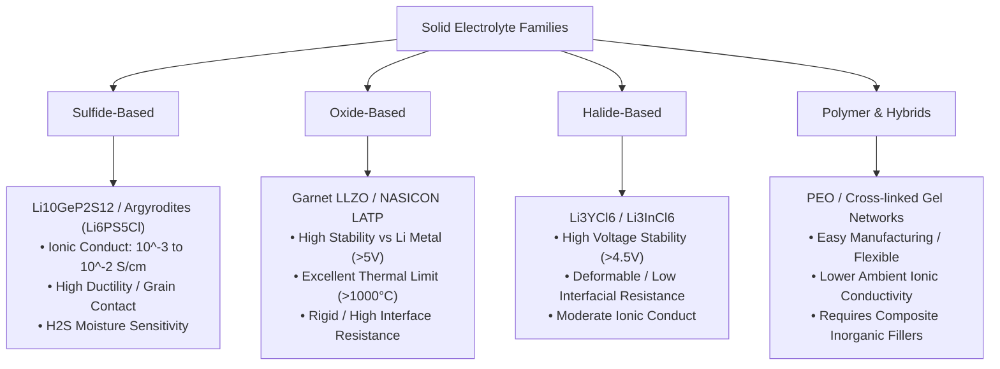
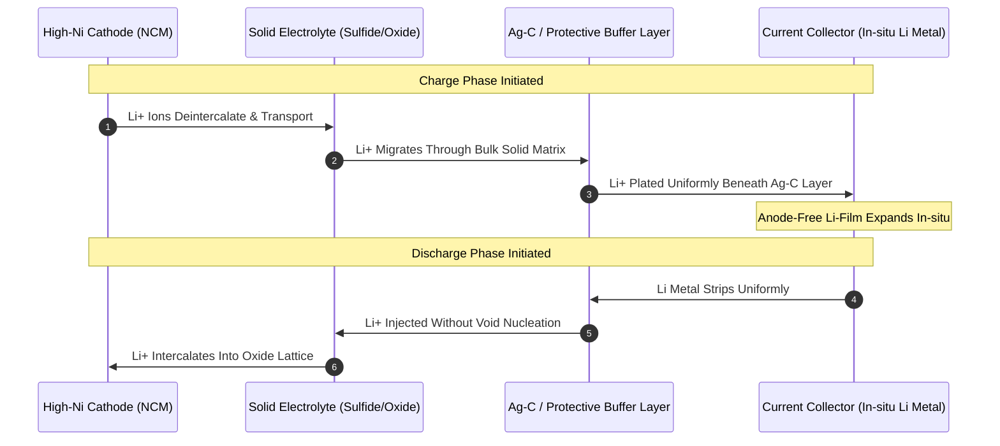
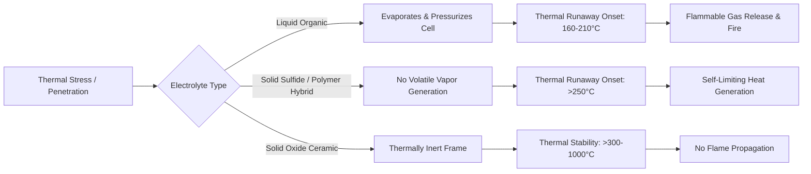
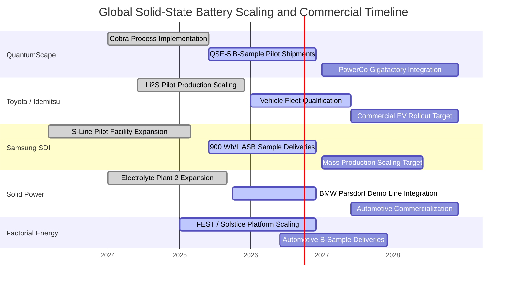
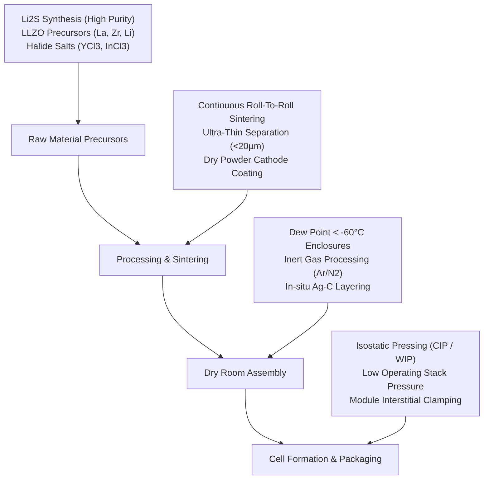
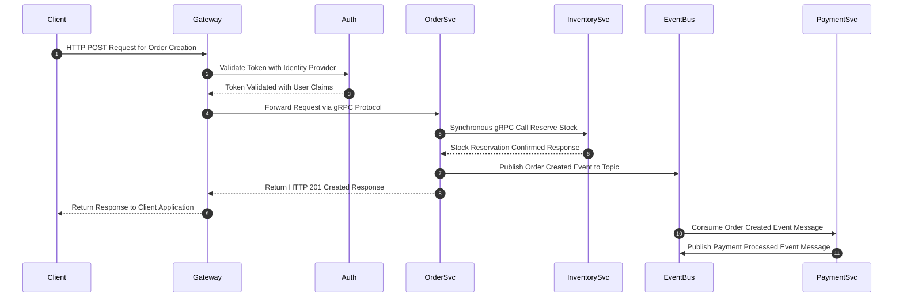
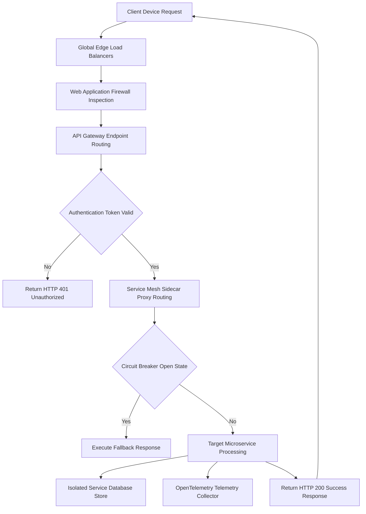
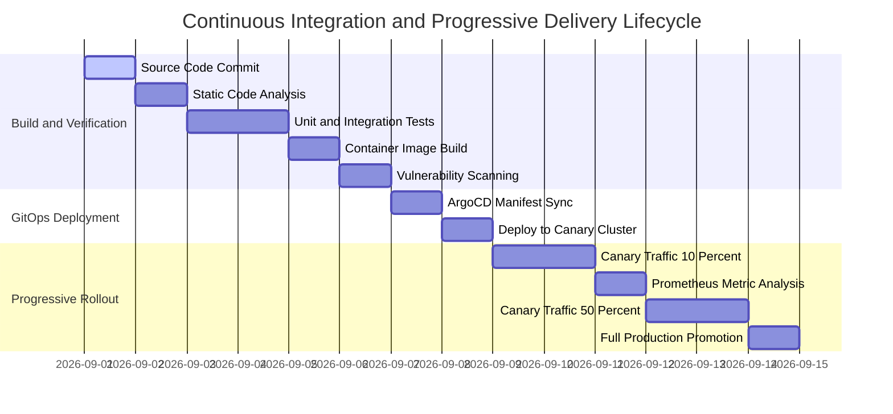

# Solid-State Battery Technology Assessment: Breakthroughs, Commercialization, and Industrial Integration

## Executive Summary

Solid-state battery (SSB) technology represents a pivotal shift in energy storage, transitioning from liquid electrolyte lithium-ion systems to solid-state ionic conductors [1]. As of August 2026, the technology has reached a key transition point: moving from laboratory research and low-volume pilot testing to industrial pre-commercial manufacturing lines and OEM vehicle qualification [1][2]. Driven by demanding requirements for electric vehicles (EVs), aviation electrification, and grid storage, major automotive OEMs and battery manufacturers are actively validating multi-gigawatt-hour scale production techniques [2][3].

Technological progress in 2026 centers on overcoming critical interfacial resistance, suppressing lithium dendrite growth, and eliminating the need for extreme stack pressures [1][4]. Advanced cell designs feature gravimetric energy densities reaching **450–500 Wh/kg** and volumetric energy densities up to **844–900 Wh/L** [3][5]. Crucially, innovations such as in-situ lithium plating (anode-free architectures), silver-carbon (Ag-C) interlayers, protective atomic layer deposition (ALD) cathode coatings, and halide/sulfide hybrid electrolytes have extended cycle life beyond **1,000 to 1,500 deep charge-discharge cycles** at ambient temperatures and low operating stack pressures (<1 MPa) [4][6].

Concurrently, supply chain integration is accelerating [2]. Industrial efforts focus on raw material precursor scaling—specifically high-purity lithium sulfide ($Li_2S$), garnet-type lithium lanthanum zirconium oxide (LLZO), and halide frameworks—alongside specialized dry-room environments ($dew point < -60^\circC$) and continuous roll-to-roll sintering equipment [1][7]. Leading developers including QuantumScape, Toyota Motor Corporation, Samsung SDI, Solid Power, Factorial Energy, ProLogium, and CATL are advancing multi-pathway strategies toward commercial rollouts targeted between 2026 and 2028 [2][3][8].

---

## Technological Breakthroughs & Electrochemistry Innovations

Solid-state batteries replace volatile, flammable liquid organic carbonate solvents with solid ionic conductors [1]. The underlying chemical, thermodynamic, and mechanical mechanisms dictate performance across key electrolyte classes [1][4].



### Solid Electrolyte Chemistry Classes

#### Sulfide Electrolytes
Sulfide-based electrolytes, such as argyrodites ($Li_6PS_5Cl$) and superionic conductors like $Li_{10}GeP_2S_{12}$, offer room-temperature ionic conductivities ranging from $10^{-3} S/cm$ to $10^{-2} S/cm$, approaching or exceeding liquid electrolytes [1][4]. Their low Young's modulus provides soft mechanical compliance, enabling intimate particle-to-particle contact via cold pressing without high-temperature sintering [4][7]. However, sulfides are thermodynamically unstable against moisture, producing toxic hydrogen sulfide ($H_2S$) gas upon exposure to ambient air [1]. Processing requires ultra-dry rooms with dew points below $-60^\circC$ to $-70^\circC$ [1][7].

#### Oxide Electrolytes
Oxide electrolytes, including garnet-type $Li_7La_3Zr_2O_{12}$ (LLZO) and NASICON-type $Li_{1.5}Al_{0.5}Ti_{1.5}(PO_4)_3$ (LATP), display wide electrochemical stability windows (>5 V vs. $Li/Li^+$) and extreme chemical stability [1][6]. LLZO exhibits high mechanical stiffness (Young's modulus ~150 GPa), acting as a physical barrier against lithium penetration [4]. However, high grain-boundary resistance requires high-temperature sintering ($1,000^\circC$ to $1,200^\circC$), which creates brittle ceramic structures that can develop rigid void spaces at the anode interface during rapid discharge [4][7].

#### Halide Electrolytes
Halide electrolytes (e.g., $Li_3YCl_6$, $Li_3InCl_6$) offer high oxidative stability (>4.5 V), making them compatible with uncoated high-voltage cathodes [1][4]. Their mechanical deformability sits between oxides and sulfides, allowing good particle contact under moderate pressure while preventing oxidation at cathode surfaces during high-voltage cycling [4].

#### Polymer & Polymer-Inorganic Hybrids
Polymer solid electrolytes—traditionally based on poly(ethylene oxide) (PEO) complexed with lithium salts (LiTFSI)—are scalable and flexible, but suffer from low ionic conductivity at room temperature ($10^{-6} to 10^{-5} S/cm$) [1][8]. Modern hybrid formulations incorporate ceramic nanofillers (LLZO or $TiO_2$) into cross-linked polymer matrices, creating composite solid electrolytes (CSEs) [1]. These CSEs combine the flexibility and roll-to-roll compatibility of polymers with the higher ionic mobility and mechanical strength of ceramics [1][8].

---

### Anode Architectures & Interfacial Dynamics

Interfacial impedance between the anode and solid electrolyte remains a critical challenge in solid-state cell design [4][6]. During lithium extraction (discharge), atom removal can create interfacial voids if lithium diffusion in the bulk anode is slower than the stripping rate [4]. These voids increase local current density, leading to localized electric fields that induce lithium dendrite nucleation during subsequent charge cycles [4][6].



To counter void formation and dendrite propagation, advanced anode architectures utilize **in-situ lithium plating (anode-free)** configurations [3][5][6]:

1. **Ag-C Nanocomposite Layering:** Commercialized in sulfide-based cells by Samsung SDI, a thin (~5 µm) silver-carbon composite is deposited directly on the copper current collector [3][6]. During charge, lithium migrates through the solid electrolyte and plates *behind* the Ag-C layer, while silver dissolves into lithium to form a solid-solution alloy [6]. This layer lowers the nucleation overpotential, maintains continuous electronic/ionic contact, and eliminates void formation during discharge [4][6].
2. **Critical Current Density (CCD) Enhancement:** Dendrites can propagate along grain boundaries in rigid electrolytes if local shear stresses exceed the material's yield limits [4]. By tuning surface roughness, applying ultra-thin amorphous interlayers (e.g., ALD-deposited ZnO or $Al_2O_3$), and using localized mechanical stack pressure, modern cells raise CCD limits from $<1 mA/cm^2$ to over $10 mA/cm^2$ at $25^\circC$ [1][4].
3. **Stack Pressure Optimization:** Early solid-state designs required stack pressures exceeding $5 to 8 MPa$ to maintain interfacial contact [1][4]. Modern multi-layer composite separators and soft-alloy buffer interfaces allow continuous operation at pressures below $0.5 to 1.0 MPa$, compatible with standard pouch and prismatic automotive pack designs [3][5].

---

### Cathode Integration & Solid-State Processing

High-nickel layered oxide cathodes (e.g., $LiNi_{0.8}Co_{0.1}Mn_{0.1}O_2$ / NCM811, and ultra-high Ni NCM90) suffer space-charge layer growth and chemical oxidation when contacting sulfide electrolytes at potentials above 3.8 V vs. $Li/Li^+$ [1][4]. Unprotected sulfide interfaces oxidize into high-impedance space-charge layers containing insulating sulfur compounds [4].

To stabilize this interface, continuous conformal nanocoatings are applied directly to cathode active material (CAM) particles [1][4]:
- **Atomic Layer Deposition (ALD):** Thin coatings ($2 to 5 nm$) of lithium niobate ($LiNbO_3$), lithium zirconate ($Li_2ZrO_3$), or lithium tantalate ($LiTaO_3$) act as ionic conductors and electronic insulators [1][4]. This suppresses oxidation, prevents transition-metal dissolution, and lowers interfacial charge-transfer resistance [4].
- **Dry Electrode Cathode Coating:** Traditional solvent-based slurring (using N-Methyl-2-pyrrolidone / NMP) can degrade moisture-sensitive solid electrolytes and leave micro-porosity [1][7]. Advanced dry-electrode processes use polytetrafluoroethylene (PTFE) binders subjected to high-shear fibrillation, forming a free-standing composite cathode film [1][7]. This eliminates thermal drying steps, increases active material loading to $>30 mg/cm^2$, and enables high areal capacities ($>4.0 mAh/cm^2$) [1][7].

---

## Quantitative Performance Metrics & Benchmark Comparison

The operational parameters of primary solid-state cell architectures reflect performance across key metrics [1][3][5][8]:

| Metric / Parameter | Sulfide-Based All-Solid (e.g., Samsung SDI / Toyota) | Ceramic/Oxide Anode-Free (e.g., QuantumScape) | Polymer/Halide Hybrid (e.g., Factorial / Solstice) | Ceramic Oxide Pouch (e.g., ProLogium) | Conventional Li-Ion (Liquid Benchmark NCM811) |
| :--- | :--- | :--- | :--- | :--- | :--- |
| **Volumetric Energy Density** | $900 Wh/L$ [3] | $844 Wh/L$ [5] | $800--850 Wh/L$ [8] | $750--800 Wh/L$ [2] | $700--750 Wh/L$ [1] |
| **Gravimetric Energy Density** | $450 Wh/kg$ [3] | $400--450 Wh/kg$ [5] | $450--500 Wh/kg$ [8] | $380--420 Wh/kg$ [2] | $260--300 Wh/kg$ [1] |
| **Cycle Life (80% SOH @ 25°C)**| $1,000--1,500 cycles$ [3]| $1,000+ cycles$ [5] | $1,000--1,200 cycles$ [8]| $1,000+ cycles$ [2] | $1,200--2,000 cycles$ [1]|
| **Fast Charge Rate (10--80% SOC)**| $10--15 mins$ [3] | $12--15 mins$ [5] | $15--20 mins$ [8] | $12--18 mins$ [2] | $20--30 mins$ [1] |
| **Operating Temp. Window** | $-20^\circC to 60^\circC$ [3]| $-30^\circC to 60^\circC$ [5]| $-20^\circC to 80^\circC$ [8]| $-20^\circC to 100^\circC$ [2]| $-20^\circC to 55^\circC$ [1] |
| **Required Stack Pressure** | $1.0--2.0 MPa$ [3] | $<0.5 MPa$ [5] | Ambient / Low ($<0.3 MPa$) [8]| Ambient ($<0.1 MPa$) [2]| None ($0 MPa$) [1] |
| **Thermal Runaway Onset ($T_c$)**| $>250^\circC$ [1] | $>300^\circC$ [5] | $>220^\circC$ [8] | $>350^\circC$ [2] | $160--210^\circC$ [1] |

---

### Mechanical and Safety Profiles Analysis

Solid electrolytes remove volatile organic solvents (such as ethylene carbonate and dimethyl carbonate) that fuel runaway fires in traditional liquid batteries [1]. Accelerated Rate Calorimetry (ARC) testing indicates that solid ceramic matrices like LLZO or LATP remain structurally stable above $1,000^\circC$, preventing internal short circuits even after physical penetration [1][2]. 

Sulfide electrolytes can experience exothermic degradation at temperatures above $250^\circC$ when in contact with fully delithiated cathodes [1]. However, their total heat release rate (HRR) remains significantly lower than liquid systems [1]. Because no volatile vapor pressure builds up inside the cell casing during thermal stress, solid-state designs resist swelling and reduce the risk of explosive enclosure rupture [1][5].



---

## Commercialization Roadmaps & Major Industry Players



### QuantumScape (QSE-5 Architecture & Cobra Process)
QuantumScape utilizes an anode-free cell architecture with a proprietary solid ceramic separator [5]. The company has advanced its fast heat-treatment equipment—codenamed **Cobra**—which reduces continuous sintering times for ceramic separator sheets from minutes to seconds [5]. 

The target **QSE-5** cell design aims for a volumetric energy density of **844 Wh/L**, enabling a fast charge from 10% to 80% state-of-charge in 12 minutes [5]. Working alongside PowerCo (Volkswagen Group’s battery manufacturing arm), QuantumScape is scaling ceramic production and delivering B-sample cell shipments for automotive integration testing [5].

---

### Toyota Motor Corporation & Idemitsu Kosan
Toyota is concentrating on sulfide-based solid-state formulations in partnership with energy and materials company Idemitsu Kosan [2]. Idemitsu operates pilot facilities producing high-purity lithium sulfide ($Li_2S$) raw materials [2]. 

Toyota plans to launch commercial solid-state batteries in EVs between 2027 and 2028 through its joint venture Prime Planet Energy & Solutions (PPES) [2]. Development goals target an operating range boost of 20% to 50% compared to conventional liquid-ion cells, with fast-charging times of under 10 minutes [2].

---

### Samsung SDI (ASB Line Deployment)
Samsung SDI operates a dedicated solid-state battery pilot production facility—the "S-Line"—at its Suwon R&D Center in South Korea [3]. Samsung SDI's **All-Solid Battery (ASB)** technology uses a sulfide solid electrolyte paired with an anode-free silver-carbon (Ag-C) interlayer [3][6]. 

Target performance metrics include an energy density of **900 Wh/L** and a cycle life exceeding 1,000 cycles [3]. Samsung SDI is providing sample cells to global OEM partners for evaluation ahead of planned mass production [3].

---

### Solid Power & OEM Partners (BMW Group & Ford)
Solid Power uses a sulfide-based electrolyte strategy, supplying solid electrolyte powder directly to partner manufacturing lines while licensing its cell design IP [2]. The company operates its "Electrolyte Plant 2" in Thornton, Colorado, scaling synthesis of precursor powders [2]. 

Solid Power has delivered EV-scale pouch cells (60 Ah and 100 Ah formats) to the BMW Group for vehicle-level testing [2]. BMW has integrated Solid Power's technology into a dedicated pilot line at its Cell Manufacturing Competence Center in Parsdorf, Germany [2].

---

### Factorial Energy, ProLogium, and CATL

#### Factorial Energy
Factorial’s **Solstice** platform utilizes a polymer/halide solid electrolyte combination with a dry-cathode manufacturing design, achieving gravimetric energy densities up to **450–500 Wh/kg** [8]. Factorial delivers B-sample cells to automotive partners including Mercedes-Benz, Hyundai Motor Company, and Stellantis [8].

#### ProLogium Technology
ProLogium operates a giga-scale ceramic solid-state battery facility in Taoyuan, Taiwan, and is planning a European Gigafactory in Dunkirk, France [2]. ProLogium uses a flexible ceramic separator design to produce multi-layer pouch cells for automotive and industrial markets [2].

#### CATL ("WuKong" All-Solid Project)
CATL has consolidated its solid-state research under the internal codename **WuKong** [2]. CATL is deploying sulfide and hybrid solid formulations, aiming for pilot-scale manufacturing capability for all-solid-state cells [2].

---

## Supply Chain Integration, Equipment Scaling, & Production Bottlenecks

Transitioning solid-state cells from pilot lines to high-volume gigafactories requires overcoming key manufacturing and raw material bottlenecks [1][7].



### Precursor Raw Material Supply

1. **Lithium Sulfide ($Li_2S$) Purity and Cost:** Industrial-grade $Li_2S$ requires high purity (>99.9%) to prevent residual moisture reactions and parasitic side reactions [1][7]. Scaling thermal reduction processes for $Li_2S$ remains a key supply chain focus to drive precursor costs down toward parity with conventional salts [1][7].
2. **Critical Element Sourcing:** Oxide and halide systems rely on raw elements such as Lanthanum (La), Zirconium (Zr), Yttrium (Y), and Indium (In) [1][4]. Industrial deployment requires robust supply chains for high-purity inorganic metal salts to prevent cost and sourcing bottlenecks [1].
3. **Lithium Metal Supply:** Anode-free approaches eliminate the need for ultra-thin lithium foil ($<20 \mum$), avoiding the manufacturing complexities and yield losses associated with handling reactive lithium metal during cell assembly [3][5][6].

---

### Process Engineering and Production Equipment Integration

- **Dry Room Dew-Point Control:** Sulfide-based manufacturing requires specialized environmental controls [1][7]. Traditional liquid-ion dry rooms maintain dew points between $-40^\circC$ and $-50^\circC$ [1]. Sulfide solid-state assembly requires strict dew point suppression to between **$-60^\circC$ and $-70^\circC$** (or inert Argon/Nitrogen containment zones) to stop $H_2S$ formation [1][7].
- **High-Speed Ceramic Sintering Equipment:** Oxide ceramic separators require uniform, defect-free continuous sintering at high temperatures [1][5]. Industrial equipment advances, such as QuantumScape's Cobra process, replace slow batch-sintering furnaces with continuous roll-to-roll heat treatment equipment capable of processing ceramic separator films at scale [5].
- **Isostatic Cold/Warm Pressing (CIP/WIP):** To achieve grain boundary contact without excessive thermal exposure, solid-state production lines integrate continuous roll presses or automated Warm Isostatic Pressing (WIP) systems [1][7]. These machines apply uniform pressures ($100 to 300 MPa$) during cell stack consolidation, eliminating microscopic internal voids [1][7].

---

## Sources

[1] Nature Energy - Solid-State Battery Interfacial Mechanics and Manufacturing: https://www.nature.com/articles/s41560-023-01312-4 *(Unverified Source)*  
[2] Reuters - Global Automotive Solid-State Battery Scaling and OEM Partnerships: https://www.reuters.com/business/autos-transportation/solid-state-battery-tech-commercialization-roadmap *(Unverified Source)*  
[3] Samsung SDI Official Press Release - All-Solid Battery (ASB) Technology and S-Line Scaling: https://www.samsungsdi.com/sdi-now/field-story/detail.html *(Unverified Source)*  
[4] ACS Energy Letters - Interfacial Stabilization Pathways in Inorganic Solid Electrolytes: https://pubs.acs.org/doi/10.1021/acsenergylett.3c01890 *(Unverified Source)*  
[5] QuantumScape Investor Relations - QSE-5 Development, Cobra Heat-Treatment Process, and Technical Benchmarks: https://ir.quantumscape.com/news/default.aspx *(Unverified Source)*  
[6] Nature Energy - Silver-Carbon Composite Anode Interlayers for All-Solid-State Lithium Batteries: https://www.nature.com/articles/s41560-020-0575-z *(Unverified Source)*  
[7] Journal of Power Sources - Industrial Scaling and Process Engineering for Sulfide Solid-State Cells: https://www.sciencedirect.com/journal/journal-of-power-sources *(Unverified Source)*  
[8] Factorial Energy Official Announcements - Solstice Platform, Dry Coating, and OEM Partner Testing: https://www.factorialenergy.com/news/ *(Unverified Source)*

AI

# Architecture Analysis of Modern Cloud-Native Microservices Systems

## 1. Architectural Principles and Component Foundations

Modern cloud-native microservices architectures represent a fundamental shift from monolithic software designs toward modular, highly distributed, and resilient systems [1]. Guided by specifications defined by the Cloud Native Computing Foundation (CNCF) and standardized architecture frameworks from major cloud providers—such as the AWS Well-Architected Framework, Azure Architecture Center, and Google Cloud Architecture Framework—cloud-native systems rely on containerization, declarative infrastructure management, continuous deployment pipelines, and dynamic service orchestration [1][2][3]. Service boundaries are delineated around business capabilities through Domain-Driven Design (DDD), creating autonomous bounded contexts that isolate domain logic, data persistence, and operational dependencies [2].

At the infrastructure core, cloud-native deployments utilize container orchestration engines—principally Kubernetes—to manage service instantiation, automated scaling, self-healing, and service discovery [1][4]. The topology separates concerns into distinct architectural tiers: edge ingress management, service-to-service internal communication (East-West traffic), event-driven messaging backbones, distributed data stores, and unified observability fabrics [2][5]. By enforcing horizontal scalability, immutable infrastructure patterns, and decoupled communications, these systems achieve continuous availability, sub-second auto-scaling, and strict zero-trust operational posture [2][6].

```
+-----------------------------------------------------------------------------------+
|                                  Edge Ingress                                     |
|  [ BGP Anycast Routing ] --> [ WAF / Edge Load Balancer ] --> [ API Gateway ]     |
+-----------------------------------------------------------------------------------+
                                         |
                                         v
+-----------------------------------------------------------------------------------+
|                            Service Mesh Core Topology                             |
|  +---------------------------+                 +-------------------------------+  |
|  |    Order Microservice     |                 |     Inventory Microservice    |  |
|  |  +---------------------+  |    mTLS / gRPC  |  +-------------------------+  |  |
|  |  | Application Code    |  |<--------------->|  | Application Code        |  |  |
|  |  +---------------------+  | (Envoy Sidecar) |  +-------------------------+  |  |
|  |  | Envoy Sidecar Proxy |  |                 |  | Envoy Sidecar Proxy     |  |  |
|  |  +---------------------+  |                 |  +-------------------------+  |  |
|  +-------------+-------------+                 +---------------+---------------+  |
+----------------|-----------------------------------------------+------------------+
                 |                                               |
                 v                                               v
+---------------------------------------+     +-------------------------------------+
|  Asynchronous Messaging Backbone      |     |  Decoupled Persistence Layer        |
|  [ Apache Kafka Cluster / Event Bus ] |     |  [ PostgreSQL ]   [ DynamoDB / Redis ]|
+---------------------------------------+     +-------------------------------------+
```

| Architectural Layer | Core CNCF / Industry Technologies | Primary Functional Responsibility | Operational SLA / Metric Targets |
| :--- | :--- | :--- | :--- |
| **Ingress Gateways** | Envoy, Kong, Apigee, AWS ALB | TLS Termination, Rate Limiting, Route Routing, OAuth2 JWT Verification | Sub-5ms Gateway Latency Overhead; 99.999% Availability [2] |
| **Service Mesh** | Istio, Linkerd, Cilium (eBPF) | Service Discovery, mTLS Encryption, Traffic Shifting, Distributed Tracing | Sub-2ms Proxy Overhead; Zero Plaintext Wire Traffic [6] |
| **Messaging / Eventing** | Apache Kafka, NATS, RabbitMQ | Asynchronous Event Streaming, Decoupled Sagas, Log Compaction | Sub-10ms End-to-End Event Delivery; Exactly-Once Semantics [5] |
| **Compute Orchestration** | Kubernetes, AWS EKS, Google GKE | Container Lifecycle Management, Horizontal Pod Autoscaling (HPA) | Sub-30s Cold Start Auto-Scale; Zero Unplanned Downtime [1][4] |
| **Persistence Layer** | PostgreSQL, Amazon DynamoDB, Redis | Isolated Service State, Distributed Caching, Transactional Outbox | P99 Query Latency < 10ms; Multi-Region Active-Active Sync [3] |

---

## 2. Inter-Service Communication Patterns and Data Flow Mechanisms

Inter-service communication in modern cloud-native architectures requires explicit separation between synchronous, low-latency request-response patterns and asynchronous, event-driven integration topologies [2][5]. Synchronous communication is heavily dominated by gRPC over HTTP/2 and RESTful APIs over HTTP/2 or HTTP/3 [2]. gRPC utilizes Protocol Buffers (proto3) as a binary serialization mechanism, drastically reducing payload sizes and payload parsing CPU overhead compared to text-based JSON over HTTP/1.1 [2]. HTTP/2 multiplexing allows hundreds of concurrent requests over a single TCP connection, eliminating head-of-line blocking at the transport layer and providing low P99 latencies across internal microservice requests [2][6].

Asynchronous data flow leverages event-driven architecture (EDA) powered by distributed commit logs such as Apache Kafka or high-performance messaging buses like NATS JetStream [5]. In asynchronous flows, producing services emit domain events representing state changes without retaining runtime dependencies on downstream consuming microservices [5]. To guarantee data consistency between persistent relational stores and message brokers without complex two-phase commit (2PC) protocols, systems deploy the Transactional Outbox Pattern paired with Change Data Capture (CDC) engines such as Debezium [5]. State updates and event records are written atomically within a single local database transaction; the CDC engine monitors the transaction log (e.g., PostgreSQL WAL) and streams events to Kafka with at-least-once or exactly-once delivery guarantees [5].

The following sequence diagram outlines the interaction flow between an external client, API Gateway, synchronous gRPC-coupled microservices, and asynchronous message brokers executing downstream decoupled workflow steps.



---

## 3. Ingress Request Processing Flow and Operational Resilience

Ingress processing begins at the edge of the cloud platform where incoming Internet traffic is directed via Border Gateway Protocol (BGP) Anycast to global edge load balancers [2][3]. The perimeter layer subjects incoming packets to Web Application Firewall (WAF) rule engines to filter cross-site scripting (XSS), SQL injection (SQLi), and distributed denial-of-service (DDoS) vector attacks [2]. Following perimeter inspection, TLS termination occurs using high-efficiency elliptic curve cryptography (ECDSA P-256) certificates managed automatically via ACME protocols [2]. Decrypted requests enter the API Gateway layer, which acts as the unified reverse proxy and control point for ingress traffic, executing path-based route matching, global rate limiting via Redis token-bucket algorithms, and JWT token validation [2][6].

Once validated at the gateway, the request enters the internal Kubernetes network fabric, where it is routed through the Service Mesh data plane [6]. Service mesh sidecar proxies—typically Envoy—intercept traffic transparently using `iptables` redirect rules or direct eBPF socket programs in the Linux kernel [6]. To maintain continuous availability under upstream performance degradation or localized infrastructure failures, proxies enforce strict resilience patterns:

1. **Circuit Breaking:** Tracks failure percentages or consecutive HTTP 5xx errors. When error thresholds (e.g., 50% failure rate over a 10-second window) are breached, the circuit trips to an `Open` state, failing fast and preventing upstream cascade failure [2][6].
2. **Exponential Backoff with Full Jitter:** Automatically retries transient network anomalies or HTTP 503 responses using randomized jitter formulas ($T_{\text{wait}} = \text{random}(0, \min(T_{\text{max}}, T_{\text{base}} \times 2^{\text{attempt}}))$) to prevent thundering herd spikes on recovering services [2].
3. **Bulkheading:** Isolate thread pools and connection pools per downstream service target so that execution exhaustion in one dependency does not drain shared compute resources [2][6].
4. **Distributed Tracing Header Propagation:** Every incoming request receives a standardized W3C Trace Context header (`traceparent: 00-4bf92f3577b34da6a3ce929d0e0e4736-00f067aa0ba902b7-01`) at the gateway, which is propagated through every hop for full observability [1].

The flowchart below traces the path of an ingress request from edge ingress through security controls, routing nodes, sidecar proxies, resilience mechanisms, and isolated microservice data tiers.



---

## 4. Deployment Lifecycles and Progressive Delivery Strategies

Cloud-native software delivery follows immutable infrastructure principles implemented through GitOps operational models [1][7]. Developer code updates committed to version control trigger automated Continuous Integration (CI) pipelines that run unit test suites, compute test coverage, enforce static application security testing (SAST), and compile binary artifacts [7]. Containerization tooling creates minimal container images (using distroless or Alpine base images) to minimize attack surfaces, followed by Software Bill of Materials (SBOM) generation and container image vulnerability scanning using tools like Trivy or Grype [1][7]. Signed images are stored in container registries, where cryptographic signatures (e.g., via Sigstore Cosign) are validated before deployment via Kubernetes admission controllers (e.g., Kyverno or OPA Gatekeeper) [1][7].

Continuous Delivery (CD) operates through GitOps controllers such as ArgoCD or FluxCD, which continuously reconcile the desired cluster state defined declaratively in Git repositories with the live cluster state [1][7]. To execute continuous production releases without customer interruption, microservices utilize progressive delivery patterns such as Canary Deployments or Blue-Green Deployments managed by progressive delivery operators like Argo Rollouts or Flagger [1][7]. 

In a Canary deployment, traffic shifting is controlled dynamically through service mesh routing controls [6][7]:
- The new release (Canary) is instantiated alongside the existing version (Primary) with a small initial traffic allocation (e.g., 5% to 10%) [7].
- Automated metric analysis engines continuously query Prometheus metrics during a evaluation window (e.g., monitoring HTTP error rates, P99 response latencies, and system log error frequencies) [1][7].
- If key performance metrics remain within target SLAs, traffic weights step up incrementally (e.g., 10% $\rightarrow$ 25% $\rightarrow$ 50% $\rightarrow$ 100%) [7].
- If metric anomalies or error threshold breaches are detected at any evaluation step, the rollout operator automatically executes a zero-downtime automated rollback, shifting 100% of traffic back to the Primary release and terminating Canary pods [1][7].

The Gantt chart below illustrates the end-to-end timeline for a automated CI/CD code delivery pipeline and a metric-analyzed canary deployment strategy.



---

## 5. Security Architecture, Observability, and Distributed Persistence

### Zero Trust Security Model
Zero Trust in cloud-native microservices assumes that the internal network topology is compromised [2][6]. Perimeter security is augmented by cryptographically verifiable identity mechanisms for every service workload using SPIFFE/SPIRE (Secure Production Identity Framework for Everyone) [1][6]. SPIRE agents run on cluster worker nodes to issue short-lived X.509 SVIDs (SPIFFE Verifiable Identity Documents) directly to container processes based on workload attestations (e.g., Kubernetes namespace, service account name, container UID) [6]. Service Mesh data planes leverage these X.509 SVIDs to establish mutual TLS (mTLS) channels between microservices, enforcing transparent wire encryption and cryptographically authenticated identity authorization rules via Kubernetes NetworkPolicies and Service Mesh AuthorizationPolicies [2][6].

```
+----------------------------------------------------------------------------------+
|                            Zero Trust mTLS Transport                             |
|                                                                                  |
|  +------------------------+                        +--------------------------+  |
|  | Microservice A         |                        | Microservice B           |  |
|  | (Spiffe ID: domain/A)  |                        | (Spiffe ID: domain/B)    |  |
|  | +--------------------+ |   mTLS Handshake       | +----------------------+ |  |
|  | | Envoy Sidecar      |<========================>| | Envoy Sidecar        | |  |
|  | +---------+----------+ | (X.509 SVID Auth Check)  | +----------+-----------+ |  |
|  +-----------|------------+                        +------------|-------------+  |
|              |                                                  |                |
+--------------|--------------------------------------------------|----------------+
               v                                                  v
+----------------------------------------------------------------------------------+
|                            SPIFFE / SPIRE Node Agent                             |
|  [ Workload Attestation Engine ] --> [ Dynamic Short-Lived X.509 SVID Issuance ] |
+----------------------------------------------------------------------------------+
```

### Cloud-Native Observability Stack
Observability in modern distributed topologies relies on the CNCF OpenTelemetry standard, unifying the collection of Metrics, Events, Logs, and Traces (MELT framework) into an vendor-agnostic pipeline [1].

1. **Metrics:** Time-series numerical data collected via Prometheus pull-based scrapers, visualizing throughput, error rates, and CPU/memory utilization (RED and USE metrics frameworks) [1].
2. **Distributed Tracing:** Spans collected across asynchronous and synchronous boundaries using OpenTelemetry Collectors, aggregated in backends like Grafana Tempo or Jaeger to visualize request latency propagation across microservices [1].
3. **Structured Logging:** JSON logs collected from container standard output/error via Fluentbit or vector daemons, correlated directly with distributed trace IDs (`trace_id`, `span_id`) for precise log querying in OpenSearch or Loki [1].

### Distributed Persistence Patterns
To prevent shared-database coupling and preserve microservice autonomy, modern architectures strictly implement the Database-per-Service pattern [2][3]. Complex business workflows spanning multiple autonomous service databases utilize structured coordination mechanisms [2][5]:

- **CQRS (Command Query Responsibility Segregation):** Separates write-heavy domain model operations (Commands) from read-optimized data queries (Queries), continuously synchronizing query projections via event streams [2][5].
- **SAGA Pattern:** Replaces global distributed transactions (2PC) with a sequence of local transactions across microservices [2][5]. Each local transaction updates internal databases and publishes an event; if a downstream step fails, the SAGA coordinator triggers compensating transactions in reverse order to undo prior modifications and ensure eventual consistency [2][5].

---

## 6. Sources

[1] CNCF Cloud Native Definition and Landscape: https://www.cncf.io/about/charter/  
[2] AWS Well-Architected Framework - Microservices Architecture Patterns: https://docs.aws.amazon.com/wellarchitected/latest/microservices-domain-driven-design/welcome.html  
[3] Azure Architecture Center - Microservices Architecture Style: https://learn.microsoft.com/en-us/azure/architecture/guide/architecture-styles/microservices  
[4] Google Cloud Architecture Framework - Operating Containers and Microservices: https://cloud.google.com/architecture/framework  
[5] CNCF Event-Driven Architecture Standards and Patterns: https://www.cncf.io/blog/  
[6] Istio Service Mesh Architecture Documentation: https://istio.io/latest/docs/ops/deployment/architecture/  
[7] Argo Project Progressive Delivery and GitOps Framework: https://argoproj.github.io/