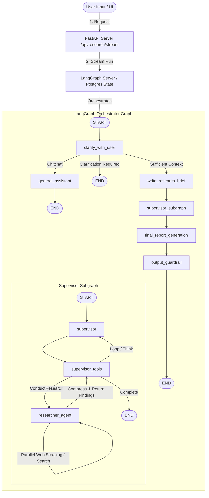

# 🔭 Scout: Multi-Agent Deep Research System - Project Analysis

This document provides a comprehensive technical analysis of the **Scout** codebase. It outlines the architectural design, graph topologies, state management, security boundaries, and local/deployment configurations.

---

## 🏛️ High-Level System Architecture

Scout is designed as a modular, stateful, multi-agent system powered by **LangGraph**, **FastAPI**, and **Streamlit**. It decouples the core agent orchestration engine (which runs as a LangGraph Server in a Docker container) from the user-facing interface.



---

## 🧩 Graph Topologies & Subgraphs

The project splits agent execution into three distinct layers to ensure separation of concerns, specialized tool access, and clean token boundaries.

### 1. The Main Orchestrator Graph
Located in [graph.py](file:///c:/Users/HP/OneDrive/Desktop/Projects/scout-research/agent/src/graph.py), this compiles the top-level workflow:
*   **`clarify_with_user`**: Performs security input check, routes greetings to the general assistant, and evaluates if the research request is clear enough.
*   **`general_assistant`**: Cheaply and quickly handles non-research inputs using `gemini-3.1-flash-lite`.
*   **`write_research_brief`**: Translates the scoped conversation history into a structured research topic brief.
*   **`supervisor_subgraph`**: Invokes the multi-agent supervisor loop.
*   **`final_report_generation`**: Synthesizes the compacted research notes into a Markdown document.
*   **`output_guardrail`**: Post-processes the report to scrub sensitive tokens, verify citation URLs, and format LaTeX.

### 2. The Supervisor Subgraph
Located in [supervisor.py](file:///c:/Users/HP/OneDrive/Desktop/Projects/scout-research/agent/src/subgraphs/supervisor.py), this coordinates the research iterations:
*   The supervisor decides whether to delegate a sub-topic to a researcher (`ConductResearch`), perform meta-cognition (`think_tool`), or finish (`ResearchComplete`).
*   Runs up to **3 concurrent sub-agents** using `asyncio.gather` for parallelized execution.
*   Performs **Context Compaction** when notes token estimates cross the **10,000 token** threshold.

### 3. The Researcher Subgraph
Located in [research_graph.py](file:///c:/Users/HP/OneDrive/Desktop/Projects/scout-research/agent/src/subgraphs/research_graph.py), this operates the actual search-and-gather loop:
*   **`llm_call`**: Reasons over the assigned topic and decides on web searches/tools.
*   **`tool_node`**: Resiliently executes search queries in parallel.
*   **`compress_research`**: Summarizes tool outputs, extracts permalinks, and yields raw notes.

---

## 💾 State Management & Reducers

Scout uses custom TypedDicts with idempotent reducers to control state merging across concurrent tasks and multi-turn runs. 

The custom state structure is defined in [state.py](file:///c:/Users/HP/OneDrive/Desktop/Projects/scout-research/agent/src/state.py):

| State Type | Keys | Reducer / Description |
| :--- | :--- | :--- |
| **`AgentState`** | `messages` <br> `supervisor_messages` <br> `raw_notes` <br> `notes` <br> `research_brief` <br> `final_report` | `messages`: standard `add_messages` <br> `raw_notes`/`notes`: `deduplicate_list` reducer (preserves insertion order, filters duplicate text blocks) |
| **`SupervisorState`** | `supervisor_messages` <br> `research_brief` <br> `notes` <br> `raw_notes` <br> `research_iterations` | Tracks internal state of the supervisor loop, isolated from the outer orchestrator messages |
| **`ResearcherState`** | `researcher_messages` <br> `tool_call_iterations` <br> `research_topic` <br> `compressed_research` <br> `raw_notes` | Tracks execution history of a single research worker agent |

---

## 🛡️ Security & Reliability Perimeters

A core highlight of the Scout architecture is its focus on safety, cost economics, and crash-recovery:

### 1. Multi-Tier Guardrails
*   **Tier 1: Regex Firewall ([input_guard.py](file:///c:/Users/HP/OneDrive/Desktop/Projects/scout-research/agent/src/guardrails/input_guard.py))**: Instantly flags prompt injection patterns (e.g., `ignore all previous instructions`, `<|im_start|>`) in `< 1ms` without LLM costs.
*   **Tier 2: Topic Classifier ([topic_classifier.py](file:///c:/Users/HP/OneDrive/Desktop/Projects/scout-research/agent/src/guardrails/topic_classifier.py))**: Classifies prompt intent (research vs. chitchat vs. dangerous) via `gemini-3.1-flash-lite`.
*   **Tier 3: Output Guardrail ([output_guard.py](file:///c:/Users/HP/OneDrive/Desktop/Projects/scout-research/agent/src/guardrails/output_guard.py))**:
    *   **Secrets/PII Scrubbing**: Redacts AWS keys, private keys, credit cards, SK/bearer tokens.
    *   **Citation Grounding**: Validates cited URLs in the output against permalinks in the raw scraper notes. Appends `*(Unverified Source)*` to hallucinated links.
    *   **LaTeX Sanitization**: Translates raw LaTeX equations and degree symbols into standard Markdown for clean rendering.

### 2. Fault Tolerance & Fallbacks
*   **Circuit Breakers**: [search.py](file:///c:/Users/HP/OneDrive/Desktop/Projects/scout-research/agent/src/utils/search.py) wraps Tavily API requests inside a `pybreaker` instance. If Tavily experiences downtime (5 consecutive errors), calls are skipped for 60 seconds.
*   **Model Fallbacks**: Model clients are constructed using `with_fallbacks` chain. For example, in `graph.py`, primary calls to `gemini-3.6-flash` fall back to `gemini-3.5-flash` if rate limits or API errors are encountered.
*   **Error Boundaries**: Nodes have native LangGraph `retry` policies (`RetryPolicy`) and top-level error boundaries (`error_handler`) to ensure that even if a node fails completely, partial reports are saved rather than crashing the system state.

---

## 📂 Codebase Layout

```text
scout-research/
├── agent/                             # LangGraph Agent package
│   ├── src/
│   │   ├── core/
│   │   │   └── research.py            # Search results processing & web page summarization
│   │   ├── guardrails/
│   │   │   ├── input_guard.py         # Regex prompt injection check
│   │   │   ├── topic_classifier.py    # Gemini boundary classifier
│   │   │   └── output_guard.py        # Secrets scrubbing & URL citation check
│   │   ├── subgraphs/
│   │   │   ├── scoping_graph.py       # Needs-clarify & brief builder
│   │   │   ├── supervisor.py          # Worker orchestrator
│   │   │   └── research_graph.py      # Search-gather worker subgraph
│   │   ├── utils/
│   │   │   ├── compaction.py          # Token-based context compaction
│   │   │   ├── search.py              # Tavily search adapter (circuit-breaker enabled)
│   │   │   └── helper.py              # String formatting & token helper functions
│   │   ├── config.py                  # Pydantic configuration load
│   │   ├── graph.py                   # Main Compiled LangGraph Orchestrator
│   │   ├── schemas.py                 # Pydantic structured schemas
│   │   └── state.py                   # State TypedDict & reducers
│   ├── DOCKERFILE                     # Docker build for LangGraph Server
│   └── langgraph.json                 # LangGraph Server route configuration
│
├── tests/                             # Unit tests (Mocked & Integration)
├── pyproject.toml                     # Python toolchain & dependency lock
├── research_service.py                # Business orchestrator mapping SDK streaming to SSE
├── agent_client.py                    # LangGraph client wrapper SDK
├── app.py                             # Streamlit dashboard chat interface
└── main.py                            # FastAPI Service layer
```

---

## 🔍 Key Insights & Recommendations

During our codebase review, we noticed a few areas of interest:

> [!NOTE]
> **Futuristic Gemini Models**: The model configurations are utilizing names like `google_genai:gemini-3.6-flash`, `gemini-3.5-flash-lite`, and `gemini-3.1-flash-lite`. Make sure the deployment environment supports these models or maps them correctly.

> [!TIP]
> **Streamlit Server Connection**: Streamlit spins up a fresh `asyncio.run()` on every execution. The current design in [app.py](file:///c:/Users/HP/OneDrive/Desktop/Projects/scout-research/app.py) handles this perfectly by avoiding connection pooling/reuse across runs, which is a common source of event-loop lockups.

> [!IMPORTANT]
> **MCP Tools Integration**: [mcp.py](file:///c:/Users/HP/OneDrive/Desktop/Projects/scout-research/agent/src/mcp.py) tries to launch an external filesystem MCP server via `npx -y @modelcontextprotocol/server-filesystem`. In environments without node/npm installed globally, this call will fail and gracefully fallback to using standard tools only.
